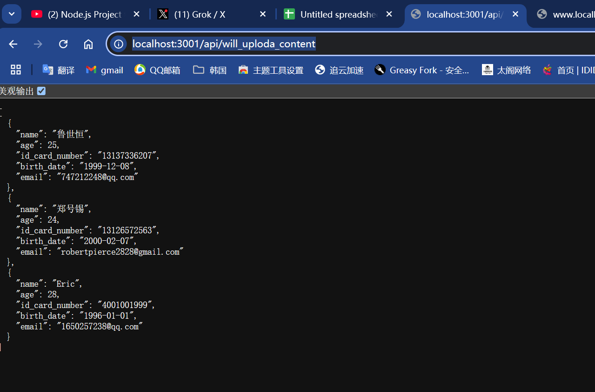
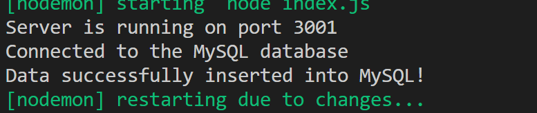

# _项目：上传文件到 mysql 数据库_

```sh
git init
git add README.md
git commit -m "first commit"
git branch -M main
git remote add origin git@github.com:lushiheng123/mysql_with_node.git
git push -u origin main
```

# 1. 后端准备工作

- # npm init -y 初始化 node 环境
- # 创建 index.js 初始脚本
  > npm init -y

# 2. 安装 xlsx 的 NodeJS 库

> npm install xlsx
> npm install mysql2 dotenv nodemon express

# 3. 将你的 xlsx 的文件放过来


# 4. 测试你的 mysql 连接,通过 dotenv 的环境变量的方式

_(用 mysql 的回调/基于 Promise 的接口测试,这里暂时 mysql2/promise 没跑通)_

> _index.js 文件_

```js
// index.js
import express from "express";
import dotenv from "dotenv";

import mysql from "mysql2/promise";

dotenv.config();

const app = express();
const port = process.env.PORT || 3000;

const dbConfig = {
  host: process.env.MYSQL_HOST,
  // 端口不加似乎也行
  port: 3306,
  user: process.env.MYSQL_USER,
  password: process.env.MYSQL_PASSWORD,
  database: process.env.MYSQL_DATABASE,
};

const try_connect = async () => {
  try {
    const connection = await mysql.createConnection(dbConfig);
    console.log("Connected to the MySQL database");
    await connection.end();
  } catch (error) {
    console.log("Error connecting to the MySql database:", error);
  }
};

app.get("/", (req, res) => {
  res.send("Hello World!");
  console.log(`API called: ${req.method} ${req.url}`);
});
app.get("/data", async (req, res) => {
  console.log(`API called: ${req.method} ${req.url}`);
  try {
    const connection = await mysql.createConnection(dbConfig);
    const [rows] = await connection.execute("SELECT * FROM chat_data");
    await connection.end();
    res.json(rows);
  } catch (error) {
    console.error("Error executing query:", error);
    res.status(500).send("Error executing query");
  }
});

app.listen(port, () => {
  console.log(`Server is running on port ${port}`);
  // 这里调用try_connect()
  try_connect();
});
```

> .env 环境文件

```.env
# .env环境文件
NODE_ENV = development
PORT= 3001
MYSQL_HOST = "localhost"
MYSQL_USER = "root"
MYSQL_PASSWORD = "123456"
# 下面是你的具体用哪个数据库
MYSQL_DATABASE = "recharts"
```

> ## 输出结果 API

## http://localhost:3001/data


## http://www.localhost:3001/


## 命令行端


# (可选)不用箭头函数，用异步函数的方式直接调用，也行

> index.js

```js
import express from "express";
import dotenv from "dotenv";

import mysql from "mysql2/promise";

dotenv.config();

const app = express();
const port = process.env.PORT || 3000;

const dbConfig = {
  host: process.env.MYSQL_HOST,
  // 端口不加似乎也行
  port: 3306,
  user: process.env.MYSQL_USER,
  password: process.env.MYSQL_PASSWORD,
  database: process.env.MYSQL_DATABASE,
};

// const try_connect = async () => {
//   try {
//     const connection = await mysql.createConnection(dbConfig);
//     console.log("Connected to the MySQL database");
//     await connection.end();
//   } catch (error) {
//     console.log("Error connecting to the MySql database:", error);
//   }
// };

// 用箭头函数的形式或者异步直接调用
async function testDatabaseConnection() {
  try {
    const connection = await mysql.createConnection(dbConfig);
    console.log("Connected to the MySQL database!");
    await connection.end();
  } catch (error) {
    console.error("Error connecting to the MySQL database:", error);
  }
}

app.get("/", (req, res) => {
  res.send("Hello World!");
  console.log(`API called: ${req.method} ${req.url}`);
});
app.get("/data", async (req, res) => {
  console.log(`API called: ${req.method} ${req.url}`);
  try {
    const connection = await mysql.createConnection(dbConfig);
    const [rows] = await connection.execute("SELECT * FROM chat_data");
    await connection.end();
    res.json(rows);
  } catch (error) {
    console.error("Error executing query:", error);
    res.status(500).send("Error executing query");
  }
});

app.listen(port, () => {
  console.log(`Server is running on port ${port}`);
  testDatabaseConnection();
  // 这里调用try_connect()
  //   try_connect();
});
```

# 5. 创建 routes（用来放后端路由 API）和 controller（功能 API），把刚才的内容作为主页放进去

```sh
tree -L 1
```


> 修改后的*index.js 文件*

```js
import express from "express";
import dotenv from "dotenv";
import { try_connect } from "./controller/db.js";

import get_current_table from "./routes/get_current_table.js";
import home_detect_connection from "./routes/home_detect_connection.js";
dotenv.config();

const app = express();
const port = process.env.PORT || 3000;

app.use("/", home_detect_connection);

app.use("/api/get_current_table", get_current_table);

app.listen(port, () => {
  console.log(`Server is running on port ${port}`);

  //   这里调用try_connect()
  try_connect();
});
```

> 创建 routes/home_detect_connection.js 路由

```js
import { Router } from "express";

const router = Router();
router.get("/", (req, res) => {
  res.send("Hello World!");
  console.log(`API called: ${req.method} ${req.url}`);
});
export default router;
```

> 创建 routes/get_current_table.js 路由

```js
import { Router } from "express";
import { get_table } from "../controller/query_get_current_table.js";
const router = Router();

router.get("/", get_table);

export default router;
```

> 创建 controller/db.js 文件，放连接数据库的功能

```js
import mysql from "mysql2/promise";
import dotenv from "dotenv";

dotenv.config();

const dbConfig = {
  host: process.env.MYSQL_HOST,
  port: 3306,
  user: process.env.MYSQL_USER,
  password: process.env.MYSQL_PASSWORD,
  database: process.env.MYSQL_DATABASE,
};

export const try_connect = async () => {
  try {
    const connection = await mysql.createConnection(dbConfig);
    console.log("Connected to the MySQL database");
    await connection.end();
  } catch (error) {
    console.log("Error connecting to the MySQL database:", error);
  }
};

export const executeQuery = async (query) => {
  try {
    const connection = await mysql.createConnection(dbConfig);
    const [rows] = await connection.execute(query);
    await connection.end();
    return rows;
  } catch (error) {
    console.error("Error executing query:", error);
    throw error;
  }
};
```

> 创建 controller/query_get_current_table.js

```js
import { executeQuery } from "./db.js";
export const get_table = async (req, res) => {
  console.log(`API called: ${req.method} ${req.url}`);
  try {
    const rows = await executeQuery("SELECT * FROM chat_data");
    res.json(rows);
  } catch (error) {
    res.status(500).send("Error executing query");
  }
};
```

> 检查两个路由:

- http://www.localhost:3001/


- http://localhost:3001/api/get_current_table
  

# 5.(连接问题搞定后)检测 xlsx 库读写 excel 文件的函数能不能正常工作

> 写个脚本测试，以下是代码，路径不要写错

```js
// Filename: read.js

// Requiring the module
import reader from "xlsx";

// Reading our test file
const file = reader.readFile("./data.xlsx");

let data = [];

const sheets = file.SheetNames;

for (let i = 0; i < sheets.length; i++) {
  const temp = reader.utils.sheet_to_json(file.Sheets[file.SheetNames[i]]);
  temp.forEach((res) => {
    data.push(res);
  });
}

// Printing data
console.log(data);
```

> 输出是文档中的内容，证明库是没有问题

## 

# （可选）写入文档的功能

> 脚本

```js
// Filename: write.js

import reader from "xlsx";

// Reading our test file
const file = reader.readFile("./data.xlsx");

// Sample data set
let student_data = [
  {
    Student: "Nikhil",
    Age: 22,
    Branch: "ISE",
    Marks: 70,
  },
  {
    Student: "Amitha",
    Age: 21,
    Branch: "EC",
    Marks: 80,
  },
];

const ws = reader.utils.json_to_sheet(student_data);

reader.utils.book_append_sheet(file, ws, "Sheet3");

// Writing to our file
reader.writeFile(file, "./data.xlsx");
```

> 效果

## 

# 6. 既然我们可以读出 excel 文件了，下一步的思路就是:

- 选择好数据库(在 env 里面选择)
- 创建/选择 _table（controller\query_get_current_table.js）_ 和其中的字段 key&value
- 导入一部分的数据库(比如 10 行)测试
- 导入全部的数据

> 已知我们的数据格式是这样
> 
> 根据 AI 的建议，创建的数据库

```sql
CREATE TABLE IDCARD (
    id INT NOT NULL PRIMARY KEY AUTO_INCREMENT COMMENT 'Primary Key',
    create_time DATETIME DEFAULT CURRENT_TIMESTAMP COMMENT 'Create Time',
    name VARCHAR(255) NOT NULL COMMENT 'Name',
    id_card_number VARCHAR(20) NOT NULL COMMENT 'ID Card Number',
    birth_date DATE NOT NULL COMMENT 'Birth Date',
    age INT COMMENT 'Age',
    email VARCHAR(255) COMMENT 'Email Address'
) COMMENT 'Table for storing ID card information';
```

> 写 controller/read_xlsx_content.js 脚本，是为了看即将插入的数据对不对，记得检测一下

```js
import reader from "xlsx";

// 读取 Excel 文件
const file = reader.readFile("./data.xlsx");

let data = [];

const sheets = file.SheetNames;

for (let i = 0; i < sheets.length; i++) {
  const temp = reader.utils.sheet_to_json(file.Sheets[file.SheetNames[i]], {
    header: 1,
  }); // 保留表头为数组，便于跳过

  // 跳过第一行（表头），从第二行开始处理数据
  for (let j = 1; j < temp.length; j++) {
    const row = temp[j];
    if (row.length > 0) {
      // 确保行不为空
      // 假设 Excel 列顺序：名字（A）、年龄（B）、身份证号（C）、出生日期（D）、Email（E）
      const name = row[0]; // 名字
      const age = row[1] ? parseInt(row[1], 10) : null; // 年龄，转换为整数或 NULL
      const idCardNumber = row[2] ? row[2].toString() : null; // 身份证号，转换为字符串或 NULL
      const birthDate = row[3] ? formatDate(row[3]) : null; // 出生日期，转换为 YYYY-MM-DD 或 NULL
      const email = row[4] ? row[4].toString() : null; // Email，转换为字符串或 NULL

      data.push({
        name,
        age,
        id_card_number: idCardNumber,
        birth_date: birthDate,
        email,
      });
    }
  }
}

// 日期格式化函数：将各种日期格式转换为 YYYY-MM-DD
function formatDate(dateValue) {
  if (!dateValue) return null;
  // 如果是字符串（如 "1999/12/10" 或 "2000-02-09"）
  if (typeof dateValue === "string") {
    // 尝试解析多种格式
    const parsedDate = new Date(dateValue);
    if (isNaN(parsedDate.getTime())) {
      // 如果解析失败，尝试特定格式（如 MM/DD/YYYY 或 YYYY/MM/DD）
      const parts = dateValue.split(/[/-]/);
      if (parts.length === 3) {
        const year =
          parseInt(parts[0], 10) > 1900
            ? parseInt(parts[0], 10)
            : parseInt(parts[2], 10);
        const month = parseInt(parts[1], 10) - 1; // 月份从 0 开始
        const day =
          parseInt(parts[0], 10) < 32
            ? parseInt(parts[0], 10)
            : parseInt(parts[1], 10);
        parsedDate = new Date(year, month, day);
      }
    }
    if (!isNaN(parsedDate.getTime())) {
      return parsedDate.toISOString().split("T")[0]; // 转换为 YYYY-MM-DD
    }
  }
  // 如果是 Excel 日期序列号（如 44197 表示 2020-12-31），需要转换
  if (typeof dateValue === "number") {
    const excelEpoch = new Date(1899, 11, 30); // Excel 的基准日期
    const date = new Date(
      excelEpoch.getTime() + (dateValue - 1) * 24 * 60 * 60 * 1000
    );
    return date.toISOString().split("T")[0];
  }
  return null; // 无法解析时返回 NULL
}
//先检查一下，再作为组件
console.log(data);
export const read_xlsx_content = (req, res) => {
  res.json(data);
};
```

> 同时添加上 route：routes/will_upload_content.js

```js
import { Router } from "express";
import { read_xlsx_content } from "../controller/read_xlsx_content.js";

const router = Router();
router.get("/", read_xlsx_content);
export default router;
```

> index.js 加上，然后测试

```js
import express from "express";
import dotenv from "dotenv";
import { try_connect } from "./controller/db.js";

import get_current_table from "./routes/get_current_table.js";
import will_upload_content from "./routes/will_upload_content.js";
import home_detect_connection from "./routes/home_detect_connection.js";
dotenv.config();

const app = express();
const port = process.env.PORT || 3000;

app.use("/", home_detect_connection);

app.use("/api/get_current_table", get_current_table);
app.use("/api/will_uploda_content", will_upload_content);
app.listen(port, () => {
  console.log(`Server is running on port ${port}`);

  //   这里调用try_connect()
  try_connect();
});
```

> 用 http://localhost:3001/api/will_uploda_content 测试
> 

# 7. 将上传数据作为 POST 的 http://localhost:3001/api/will_uploda_content 使用，具体代码如下：

> routes/will_upload_content.js

```js
import { Router } from "express";
import { read_xlsx_content } from "../controller/read_xlsx_content.js";
import { insertData } from "../controller/add_to_mysql.js";
const router = Router();
router.get("/", read_xlsx_content);
// 这里创建了post的接口
router.post("/", insertData);
export default router;
```

> controller/add_to_mysql.js

```js
import { executeQuery } from "./db.js";
import { getData } from "./read_xlsx_content.js";

export const insertData = async (req, res) => {
  try {
    const data = getData(); // 获取 Excel 数据
    const query = `
      INSERT INTO IDCARD (name, age, id_card_number, birth_date, email, create_time)
      VALUES (?, ?, ?, ?, ?, CURRENT_TIMESTAMP)
    `;

    for (let row of data) {
      const values = [
        row.name,
        row.age,
        row.id_card_number,
        row.birth_date,
        row.email,
      ];
      await executeQuery(query, values);
    }

    console.log("Data successfully inserted into MySQL!");
    res.status(200).send("Data successfully inserted into MySQL!");
  } catch (error) {
    console.error("Error inserting data:", error);
    res.status(500).send("Error inserting data: " + error.message);
  }
};
```

## 搞好后用 postman 测试 post：http://localhost:3001/api/will_uploda_content




# 8.
